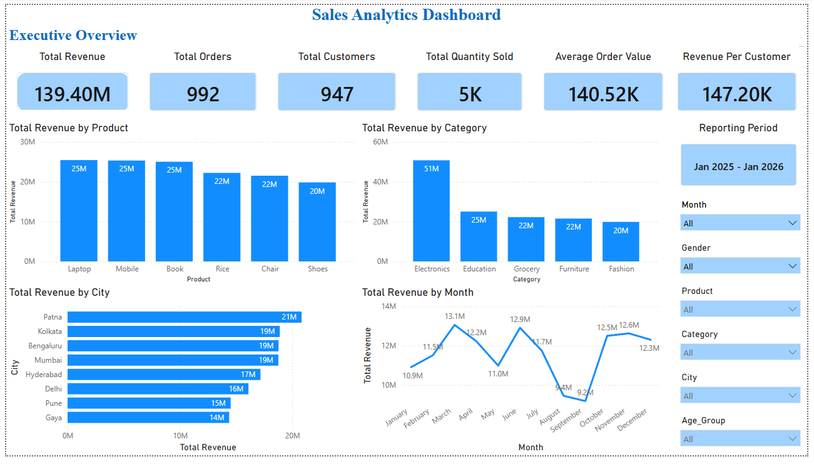
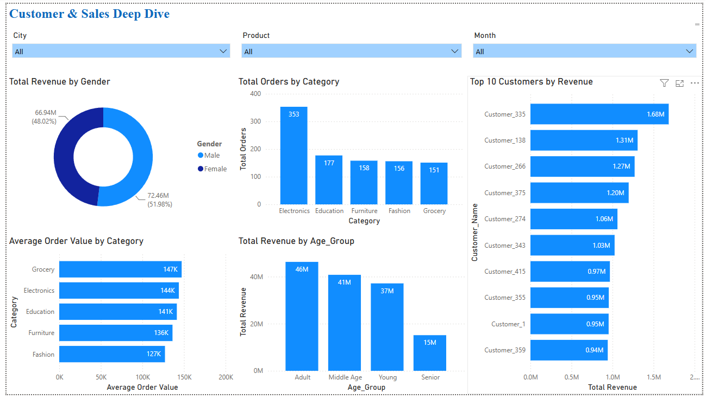

# Sales Analytics End-to-End Project

<div align="center">

## ApexPlanet Data Analytics Internship

An end-to-end **Sales Analytics** project developed as part of the **ApexPlanet Data Analytics Internship**, demonstrating the complete data analytics lifecycle—from raw data profiling and cleaning to business intelligence, interactive dashboarding, and storytelling.


</div>

---

# 📌 Internship Details

| Item | Details |
|------|---------|
| **Organization** | ApexPlanet Software Pvt. Ltd. |
| **Domain** | Data Analytics |
| **Internship ID** | APSPL2635005 |
| **Duration** | 21 May 2026 – 19 July 2026 |

---

# 🎯 Project Objective

The objective of this project is to transform raw sales data into meaningful business insights through a structured analytics workflow.

The project covers the complete analytics lifecycle:

- Data Profiling
- Data Quality Assessment
- Data Cleaning & Transformation
- Feature Engineering
- Exploratory Data Analysis (EDA)
- Business Intelligence
- SQL Analytics
- Interactive Dashboard Development
- Business Storytelling
- Portfolio Development

---

# 🔄 End-to-End Analytics Workflow

```text
Raw Sales Dataset
        │
        ▼
Data Profiling & Quality Assessment
        │
        ▼
Data Cleaning & Feature Engineering
        │
        ▼
Exploratory Data Analysis (EDA)
        │
        ▼
Business Intelligence & SQL Analysis
        │
        ▼
Interactive Power BI Dashboard
        │
        ▼
Business Storytelling
        │
        ▼
Capstone Analytics Portfolio
```

---

# 🛠 Tech Stack

## Programming

- Python
- Pandas
- NumPy

## Statistical Analysis

- SciPy
- Pearson Correlation
- Independent Sample T-Test
- One-Way ANOVA
- Confidence Interval Analysis

## Data Visualization

- Matplotlib
- Seaborn
- Power BI

## Database

- MySQL
- SQL

## Development Tools

- Jupyter Notebook
- Git
- GitHub

---

# 📂 Repository Structure

```text
Sales-Analytics-End-to-End-Project-ApexPlanet
│
├── Dataset
│   └── ApexPlanet_DataAnalytics_Dataset.xlsx
│
├── Resources
│   ├── Internship_Offer_Letter.pdf
│   ├── 60_Days_Roadmap.pdf
│   └── Project_Resources
│
├── Task-1-Data-Immersion-Wrangling
│
├── Task-2-EDA-Business-Intelligence
│
├── Task-3-DeepDive-Dashboarding
│
├── Task-4-Storytelling-Statistical-Validation
│
├── Task-5-Capstone-Portfolio
│
└── README.md
```

---

# 🚀 Internship Roadmap

| Task | Description | Status |
|------|-------------|:------:|
| Task 1 | Data Immersion & Wrangling | ✅ Completed |
| Task 2 | Exploratory Data Analysis & Business Intelligence | ✅ Completed |
| Task 3 | Deep-Dive Analysis & Interactive Dashboarding | ✅ Completed |
| Task 4 | Data Storytelling & Statistical Validation | ✅ Completed |
| Task 5 | Capstone Portfolio Project | 🚀 In Progress |

---

# 📦 Project Deliverables

## ✅ Task 1 – Data Immersion & Wrangling

### Deliverables

- Data Dictionary
- Dataset Profiling Notebook
- Data Cleaning Notebook
- Cleaned Dataset
- Data Quality Report

### Skills Applied

- Data Profiling
- Data Cleaning
- Data Validation
- Missing Value Treatment
- Feature Engineering
- Outlier Analysis

---

## ✅ Task 2 – Exploratory Data Analysis & Business Intelligence

### Deliverables

- Exploratory Data Analysis Notebook
- Business Intelligence Notebook
- SQL Business Queries
- EDA Report
- Business Insights Report

### Skills Applied

- Exploratory Data Analysis
- Business Intelligence
- SQL Analytics
- KPI Development
- Data Visualization
- Business Reporting

---

## ✅ Task 3 – Deep-Dive Analysis & Interactive Dashboarding

### Deliverables

- Interactive Power BI Dashboard
- Dashboard PDF
- Dashboard Screenshots
- Deep Dive Analysis Report
- Dashboard Documentation

### Skills Applied

- Power BI
- Dashboard Design
- Interactive Reporting
- KPI Dashboard
- Customer Analytics
- Sales Analytics

---

## ✅ Task 4 – Data Storytelling & Statistical Validation

### Deliverables

- Statistical Validation Notebook
- Data Storytelling Notebook
- Statistical Validation Report
- Storytelling Report
- Professional PowerPoint Presentation

### Skills Applied

- Statistical Analysis
- Pearson Correlation
- Independent Sample T-Test
- One-Way ANOVA
- Confidence Interval Analysis
- Business Storytelling
- Executive Reporting
- Data-Driven Decision Making

---

# 📈 Executive KPIs

| KPI | Value |
|------|-------:|
| Total Revenue | ₹139.40 Million |
| Total Orders | 992 |
| Total Customers | 947 |
| Total Quantity Sold | ~5K Units |
| Average Order Value | ₹140.52K |
| Revenue per Customer | ₹147.20K |

---

# 💡 Key Business Insights

### Product Performance

- Laptop generated the highest revenue.
- Mobile closely followed Laptop.
- Shoes generated the lowest revenue.

### Category Performance

- Electronics emerged as the highest revenue-generating category.
- Fashion generated the lowest revenue.

### Customer Insights

- Adult customers generated the highest revenue.
- Revenue distribution between Male and Female customers remained balanced.

### Regional Performance

- Patna recorded the highest revenue.
- Kolkata, Bengaluru, and Mumbai also performed strongly.

### Sales Trend

- Revenue peaked during March, June, October, and November.
- Seasonal fluctuations indicate opportunities for targeted promotional campaigns.

### Statistical Insights

- Quantity Sold and Total Sales show a strong positive correlation (r = 0.65).
- No statistically significant spending difference exists between Male and Female customers.
- Customer spending patterns remain consistent across all Age Groups.
- The estimated mean Total Sales lies within the 95% confidence interval of ₹132K–₹146K.

---

# 📊 Dashboard Preview

## Executive Overview

<p align="center">
  
</p>

---

## Customer & Sales Deep Dive

<p align="center">
  
</p>

---

# 🎯 Skills Demonstrated

## Data Analytics

- Data Profiling
- Data Cleaning
- Feature Engineering
- Exploratory Data Analysis
- Statistical Validation
- Business Intelligence
- Dashboard Development
- Data Storytelling
- KPI Development
- Business Reporting

---

## Statistical Analysis

- Pearson Correlation
- Independent Sample T-Test
- One-Way ANOVA
- Confidence Interval Analysis
- Outlier Detection

---

## Technical Skills

- Python
- Pandas
- NumPy
- SciPy
- SQL
- MySQL
- Power BI
- Git
- GitHub

---

# 🏆 Project Highlights

- ✅ End-to-End Data Analytics Project
- ✅ Professional Documentation
- ✅ Data Cleaning & Feature Engineering
- ✅ Exploratory Data Analysis
- ✅ SQL Business Intelligence
- ✅ Interactive Power BI Dashboard
- ✅ Statistical Validation
- ✅ Executive Storytelling
- ✅ Professional Presentation
- ✅ Portfolio-Ready Internship Project

---

# 📅 Current Progress

| Phase | Status |
|-------|:------:|
| Data Preparation | ✅ |
| Business Analysis | ✅ |
| Dashboard Development | ✅ |
| Statistical Validation | ✅ |
| Business Storytelling | ✅ |
| Capstone Portfolio | 🚀 In Progress |
---

# 👨‍💻 Author

## Durga Prasad Shetty

**B.Tech – Computer Science & Data Science**

CMR University, Bangalore

### 📬 Connect With Me

💼 **LinkedIn**

https://linkedin.com/in/durgaprasadshetty

🌐 **Portfolio**

https://prasad-shetty-portfolio.vercel.app/

💻 **GitHub**

https://github.com/shettyprasad-git

---

# ⭐ Support

If you found this project useful, consider giving the repository a **Star ⭐** on GitHub.

---

> **Turning raw data into strategic business decisions through analytics, statistical validation, interactive dashboards, and executive storytelling.**
